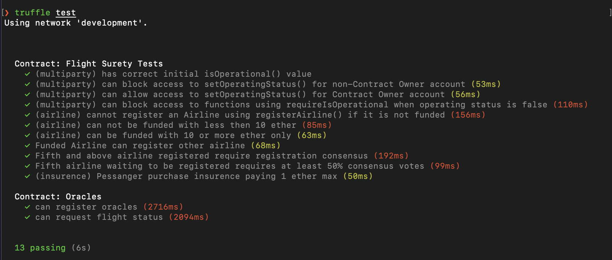
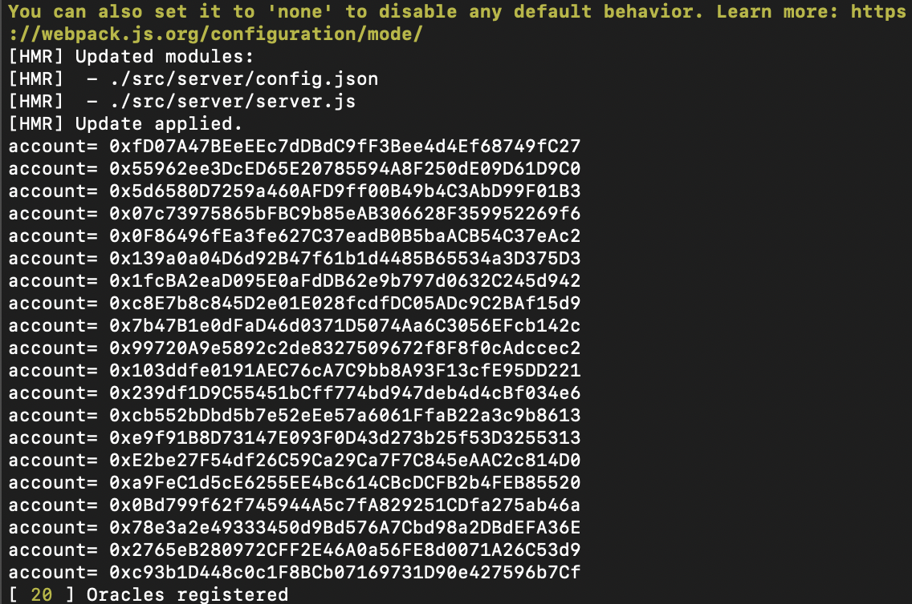
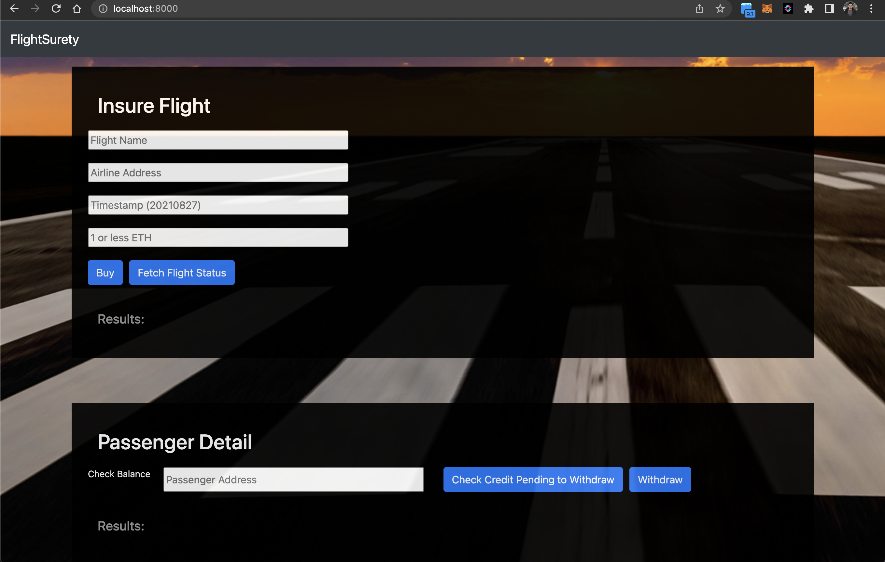

# Fight Surety Dapp

This repository containts an Ethereum DApp that simulates an flight insurance service. It is not a full version of this kind of app but it is enough to ilustrate how it could be implemented over Ethereum.

# Version requirement
```
node 15.14.0
truffle 5.0.2
solidity 0.4.24
```

# Instruction
Run the next steps to run the application:

Install dependencies
```bash
npm install
```

Compile the smart contracts
```bash
truffle compile
```

Run blockchain simulation by this account for testing
```bash
ganache-cli -a 20 -l 9999999 -m "slice congress throw plastic rely coyote margin myself together manage romance actress"
```

Terminal will show these address:
```text
Ganache CLI v6.12.2 (ganache-core: 2.13.2)

Available Accounts
==================
(0) 0xfD07A47BEeEEc7dDBdC9fF3Bee4d4Ef68749fC27 (100 ETH)
(1) 0x55962ee3DcED65E20785594A8F250dE09D61D9C0 (100 ETH)
(2) 0x5d6580D7259a460AFD9ff00B49b4C3AbD99F01B3 (100 ETH)
(3) 0x07c73975865bFBC9b85eAB306628F359952269f6 (100 ETH)
(4) 0x0F86496fEa3fe627C37eadB0B5baACB54C37eAc2 (100 ETH)
(5) 0x139a0a04D6d92B47f61b1d4485B65534a3D375D3 (100 ETH)
(6) 0x1fcBA2eaD095E0aFdDB62e9b797d0632C245d942 (100 ETH)
(7) 0xc8E7b8c845D2e01E028fcdfDC05ADc9C2BAf15d9 (100 ETH)
(8) 0x7b47B1e0dFaD46d0371D5074Aa6C3056EFcb142c (100 ETH)
(9) 0x99720A9e5892c2de8327509672f8F8f0cAdccec2 (100 ETH)
(10) 0x103ddfe0191AEC76cA7C9bb8A93F13cfE95DD221 (100 ETH)
(11) 0x239df1D9C55451bCff774bd947deb4d4cBf034e6 (100 ETH)
(12) 0xcb552bDbd5b7e52eEe57a6061FfaB22a3c9b8613 (100 ETH)
(13) 0xe9f91B8D73147E093F0D43d273b25f53D3255313 (100 ETH)
(14) 0xE2be27F54df26C59Ca29Ca7F7C845eAAC2c814D0 (100 ETH)
(15) 0xa9FeC1d5cE6255EE4Bc614CBcDCFB2b4FEB85520 (100 ETH)
(16) 0x0Bd799f62f745944A5c7fA829251CDfa275ab46a (100 ETH)
(17) 0x78e3a2e49333450d9Bd576A7Cbd98a2DBdEFA36E (100 ETH)
(18) 0x2765eB280972CFF2E46A0a56FE8d0071A26C53d9 (100 ETH)
(19) 0xc93b1D448c0c1F8BCb07169731D90e427596b7Cf (100 ETH)
```

Truffle test
* Test smartcontract
* Test oracle
```bash
truffle test
```




Deploy the smart contracts to Ganache-cli you must run in terminal:
```bash
truffle migrate --network development
```

Start the server oracle:
```bash
npm run server
```
You should see this results in terminal:



Start Dapp frontend:
```bash
npm run dapp
```
The result is:



The Dapp has 4 different sections.

1. Operational status: shows if the smart contracts are operative or locked.
2. Airline registration: allows the user to execute actions relative to the airlines

* Register - Airline Name and Airline Address are required.
* Action over Airline - Fund, Vote, Is registered, Is Funded and Is Pending actions require that user inputs the Airline Address.

3. Insure Flight: Allows a passenger to buy an insurance for an specific flight.

* Buy - Flight Name, Airline Address, Timestamp and amount are required.
* Fetch Flight Status - Send a request for the simulated oracles that are running in the server part. Flight Name, Airline Address and Timestamp are required fields.

4. Passenger Detail: Allow a passenger verify his/her accredited amount when a flight is delayed. Also allow him to withdraw the credit.

* Check Credit Pending to Withdraw - Passenger Address is required.
* Withdraw - Passenger Address is required. Allow the user to withdraw the credit obtained by his/her purchased insurance.